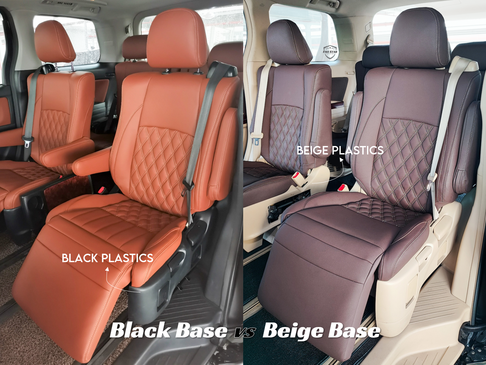
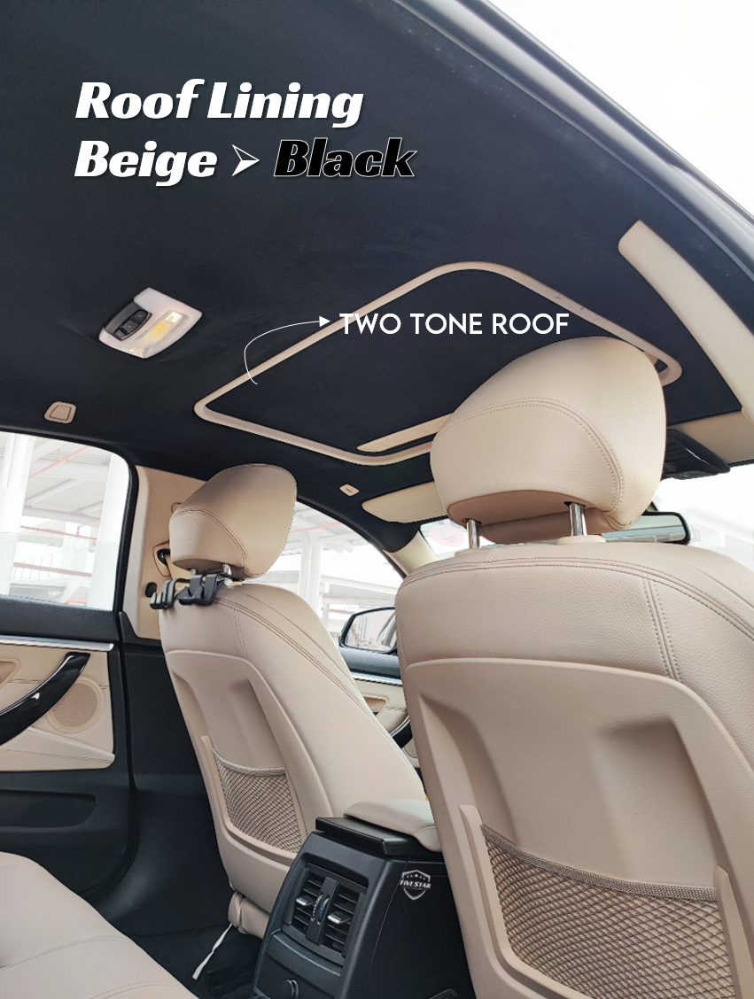
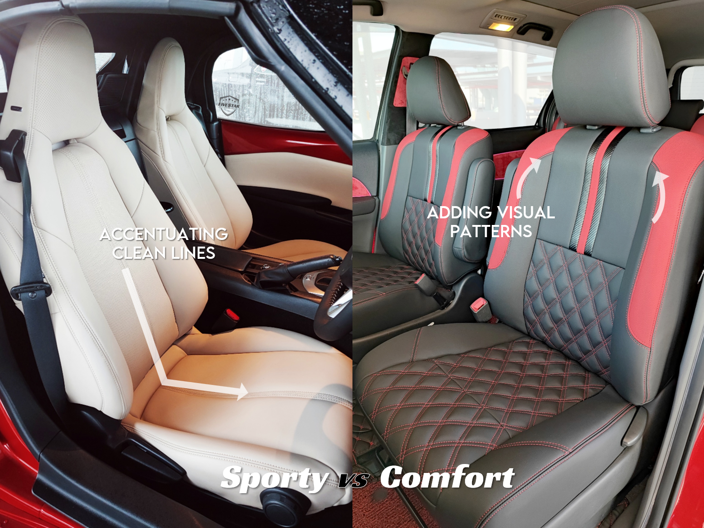

At Five Star, we believe a well-designed interior transforms the entire driving experience. While there are guides for designing houses, wardrobes and even PowerPoints, car interior design is often overlooked.

Don’t worry, we’ve got you. Here are some practical tips to help you design a car interior that looks cohesive, premium and uniquely you.

> 🎥 You can also learn these tips in our [Car Interior Design Reel](https://www.facebook.com/share/r/1CBSCh8aYJ/).

## Tip 1: Consider the Interior, Not the Exterior

When choosing leather seat colours, don’t base your decision solely on your car’s exterior paint.

Black car = black seats? Grey car = grey seats? Blue car = blue seats? _Meh… not necessarily._

What matters more is your interior base colour — the plastics, trims, carpets and door panels. Black based cars easily match any color. Beige or light grey interiors, however, require more careful colour selection to ensure everything looks cohesive. A thoughtful choice creates a clean, factory-fitted look instead of a mismatched combination.

> 💡 **Color Advice:** Beige interiors pair best with warm-tone shades. Beige-on-beige is the safest, but if you prefer something darker and easier to maintain, deep browns work well too. Black seats create a strong contrast, but that contrast can also make the cabin feel sharper and fresher.

## Tip 2: Understand What Can (and Cannot) Be Wrapped

All car seats can be rewrapped, but some interior components, like plastic handles, trims and casings, aren’t meant to be wrapped and we don’t believe in forcing what doesn’t fit or last. Our rule of thumb? If it originally came wrapped in leather or PVC, we can rewrap it professionally.

This is especially relevant for this popular request: 🙋 _“Can you change the color of my car roof to all black?”_

Yes… but if your car’s original interior is beige or grey, some structural elements like handles and plastic trims will still show in their original colour. If you can source these parts in black, that’s the ideal fix. Spray-painting is possible, but keep durability in mind, especially for high-touch areas where wear shows quickly.

## Tip 3: Match the Design to the Seat Shape

There are tons of seat design ideas online, and they look amazing — but just like clothes, what looks great on one body may not suit another. The same goes for car seats.

- Slim, sporty seats (e.g. Mazda MX-5) look best with vertical lines that accentuate its elegance
- Larger, boxier seats (e.g. Toyota Estima) benefit from patterns that break up the bulk and add visual structure
- Modern EV seats (e.g. Tesla Model 3) pair well with clean, uninterrupted surfaces and subtle stitching for a futuristic vibe

Always choose a design that works with the natural seat shape, not against it.

## Need Expert Advice?

If you’re unsure what works best for your vehicle, we’re here to help. We’ll show you colour samples, materials and real projects so you can visualise exactly how your interior will look.

**Book an appointment today**, let’s la kopi together and talk cars.

<!-- Insert link to contact us -->

💫 **Your dream car interior is just one conversation away**
