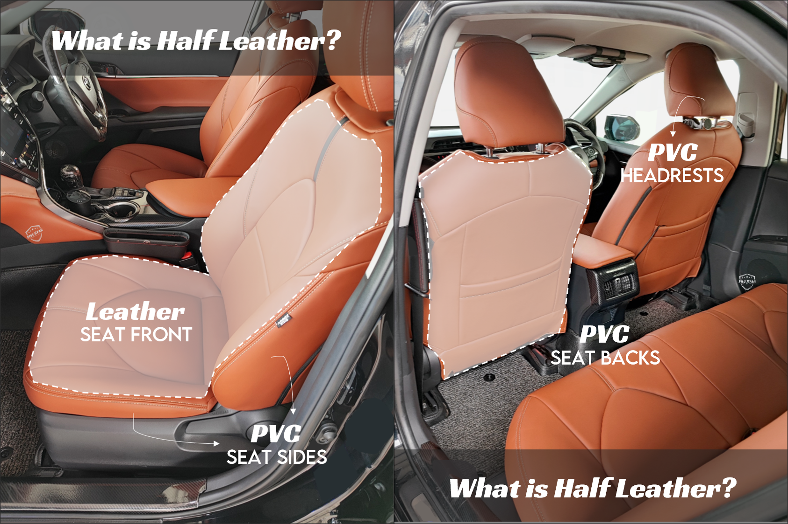
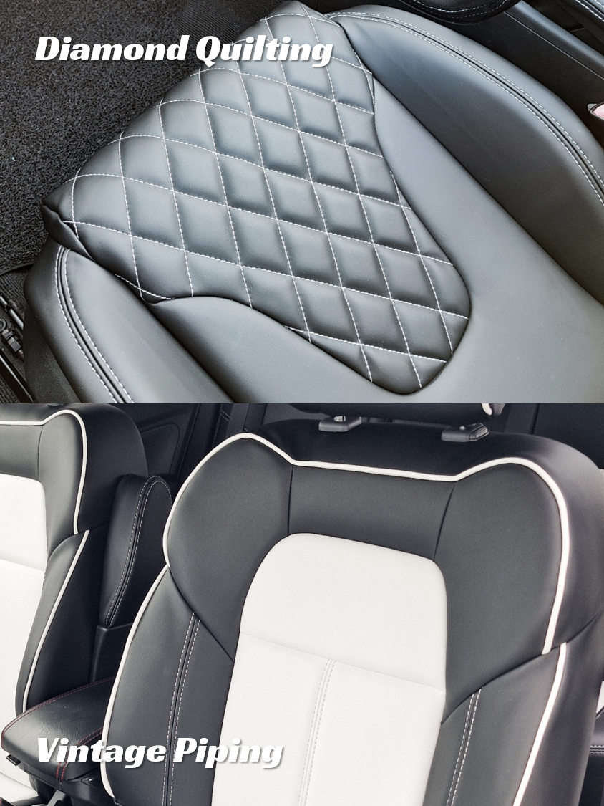

So you’ve finally decided to upgrade your car with new leather seats!👏 But excitement can quickly turn into confusion. This guide aims to demystify the world of car leather upholstery in Singapore and gives you the insights you need to make confident, informed choices.

## 1. How Do You Get New Leather Seats?

At Five Star, the process involves removing your existing seat covers and replacing them with entirely new leather – a full rewrap. While some workshops offer alternatives such as spray-painting old leather or overlaying new covers on top, a full rewrap delivers the cleanest, most fitted result. It creates the feeling of a truly refreshed interior.

Our typical lead time is three to four working days to manufacture or ship your leather covers, but actual downtime for installation usually takes less than one day.

> ✏️ Want to understand our process better? Read our article: [Seat Rewrap Process: How We Do It with Minimal Downtime](/blog/seat-rewrap-process)

> ⚡️ **Quick Tip:** If you are engaging other services such as exterior spray painting, consider coordinating the leather installation at the same time to reduce overall downtime.

## 2. What Material Should You Choose?

This is where most people get confused — especially with the mysterious term “Half Leather.” So… what exactly is it half of? 😵‍💫💫

### Half Leather

Half Leather seats combine leather on the front areas that contact your body, with PVC on the sides and back. At Five Star, we specialise in automotive-grade vegan Microfiber Leather, which is paired with PVC in our Half Leather option. This configuration is the most popular choice for personal use cars due to its balance of premium feel and affordability.

### Full Leather

Full Leather means the entire seat (front, sides, and back) is upholstered in leather. This is the preferred choice for those seeking a uniform and luxurious finish.

### PVC

PVC is the most budget-friendly option and is commonly used in commercial or rental vehicles. However, it has a more plastic texture and tends to heat up quickly under the sun.

> ✏️ Want a deeper dive? Read our article: [3 Types of Car Leather and How to Identify Them](/blog/types-of-car-leather)

## 3. What’s Included in the Price?

Always clarify what is covered in the quoted price. Matching door panels may be complimentary for Japanese or Korean make cars, but charged separately for European models. Internal foam repairs may or may not be included as well.

Services such as steering wheel or gear knob rewraps are usually priced separately. If you intend to do these, it is advisable to return to the same workshop to ensure the leather matches and potentially secure a bundled package price.

## 4. What Can You Customise?

More than you might think!

- Material type such as textured vs smooth grain, fabric alternatives like Alcantara
- Multiple colour combinations
- Leather trim details such as piping
- Stitching colour & pattern such as diamond quilting
- Embroidered logo or branding

Complex designs usually cost more. A low base price can quickly rise once customisation is added, so always request a clear breakdown to keep your budget on track.

## 5. Choosing the Right Car Upholstery Workshop

Start with Google reviews and browse finished projects on Facebook, Instagram or Carousell. Visit the workshop in person if possible, compare quotes and ask detailed questions about materials, pricing breakdowns, and design options. A trustworthy workshop will be transparent, informative and patient with your questions.

Leather seats are a long-term investment, so choose a specialist who delivers both quality and top-tier service. With Five Star’s craftsmanship, premium materials, and proven expertise, your car’s interior is in safe hands — and the results speak for themselves.
