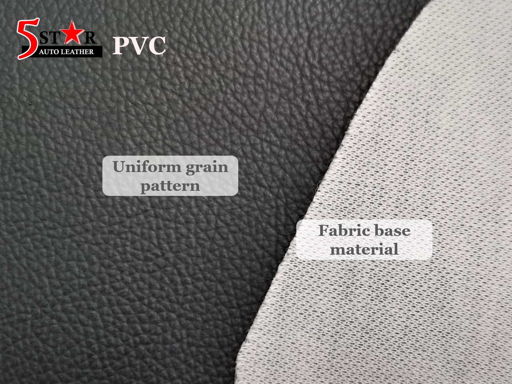
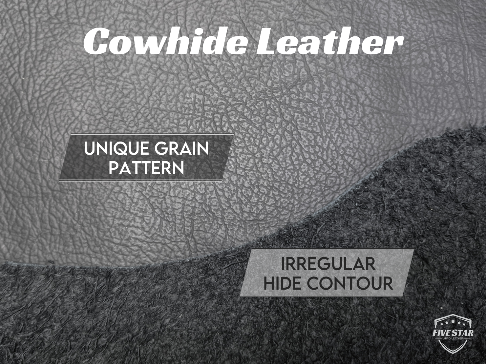
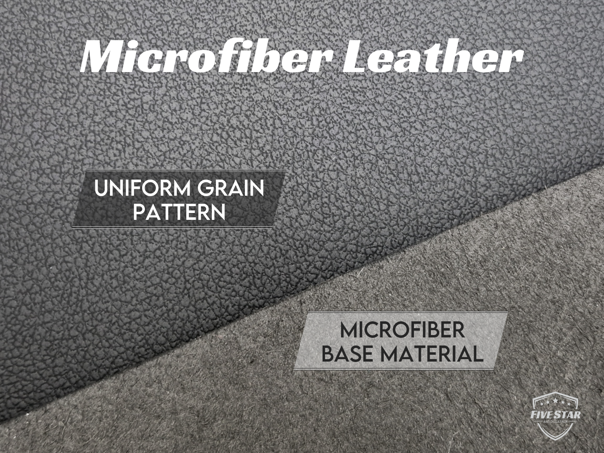

Let’s face it — the world of car leather can be confusing. Most of us aren’t experts who can name every chemical or molecular detail, and you shouldn’t have to do. What you _do_ need is enough knowledge to avoid getting sweet-talked by salespeople and to choose the right material for your lifestyle.

Here’s a clear, easy guide to the main types of automotive leather available in Singapore, and how to tell them apart yourself.

## 1. PVC

PVC is the most affordable option on the market. It is made out of a fabric base topped with a layer of Polyvinyl Chloride (thus the name PVC) which is a synthetic plastic polymer. It is the go-to option for commercial vehicles and rental fleets that need durability without the cost.

<table>
  <tbody>
    <tr>
      <td>Look & Feel</td>
      <td>
        <ul>
          <li>Leather-like grain but slightly artificial finish</li>
          <li>Firmer and more plastic to touch</li>
          <li>Heats up quickly under the sun</li>
        </ul>
      </td>
    </tr>
    <tr>
      <td>Maintenance</td>
      <td>
        <ul>
          <li>Extremely low maintenance</li>
          <li>Spill proof and easy to clean</li>
        </ul>
      </td>
    </tr>
    <tr>
      <td>Durability</td>
      <td>
        
PVC is tougher than its reputation — it handles scratches, abrasions, and rough daily use well. But when it finally wears out, PVC typically shows damage by cracking and peeling.

        
At Five Star, we use 1.1mm high quality PVC, thicker and sturdier than typical market versions.

      </td>
    </tr>
  </tbody>
</table>

### How to Identify PVC Leather

- 🧵 Fabric backing
- 🧤 Plastic–rubbery touch
- 🔁 Uniform, slightly artificial grain

## 2. Cowhide Leather

Cowhide leather car interiors are increasingly uncommon these days. While we do not discount the advantages of cowhide, the prevalence of high-quality eco-friendly alternatives have made even the luxury car manufacturers rethink their strategies – just check out Artico leather used by Mercedes and Nuluxe by Lexus.

<table>
  <tbody>
    <tr>
      <td>Look & Feel</td>
      <td>
        <ul>
          <li>Soft, strong and premium to the touch</li>
          <li>Naturally breathable</li>
          <li>Lower grade hides may show scars or flaws</li>
          <li>Colors tend to be more muted than synthetics</li>
        </ul>
      </td>
    </tr>
    <tr>
      <td>Maintenance</td>
      <td>
        <ul>
          <li>Requires proper leather cleaners & conditioners</li>
          <li>Needs routine care to stay supple</li>
        </ul>
      </td>
    </tr>
    <tr>
      <td>Durability</td>
      <td>Top grade cowhide can last for a long time. With proper conditioning, it develops a rich patina over time. But if neglected, it can dry out and eventually crack, especially under constant sunlight and daily contact with human sweat.</td>
    </tr>
  </tbody>
</table>

### How to Identify Cowhide Leather

- 👃 Chemical tanning smell
- 👀 Irregular, natural grain
- 🐄 Comes in hides, not rolls

## 3. Microfiber Leather

Microfiber leather is a next-gen vegan alternative that replicates the premium look and feel as cowhide, minus the cruelty, maintenance hassles and environmental footprint.

At Five Star, we specialise exclusively in top-tier automotive-grade microfiber leather. Crafted from ultra-fine fibres coated with high performance polyurethane resins, our leather is not only soft and supple to touch, but also clean to clean, UV- and scratch-resistant – engineered for modern car interiors.

<table>
  <tbody>
    <tr>
      <td>Look & Feel</td>
      <td>
        <ul>
<li>Soft, supple and lightweight</li>
<li>Very similar to cowhide with a uniform grain</li>
<li>Vibrant, consistent colors</li>
        </ul>
      </td>
    </tr>
    <tr>
      <td>Maintenance</td>
      <td>
        <ul>
          <li>Minimal maintenance</li>
          <li>Spill proof and easy to clean</li>
        </ul>
      </td>
    </tr>
    <tr>
      <td>Durability</td>
      <td>
        
Quality microfiber leather is flexible yet strong. It doesn’t crack – instead, it gradually wears down with years of use. Plus, modern high-performance coatings also enhance:

        <ul>
          <li>Scratch & abrasion resistance</li>
          <li>Stain resistance</li>
          <li>UV protection</li>
          <li>Air permeability</li>
        </ul>
    </tr>
  </tbody>
</table>

> ⚠️ **Note:** Do not confuse microfiber leather with PU leather used for furniture. PU has a fabric base and lower-grade resin that can’t survive sun exposure and high heat inside a car.

### How to Identify Microfiber Leather

- ✋ Soft, natural touch
- 🔍 Consistent, flawless grain
- 📏 Supplied in fabric-style rolls

> 🎥 See how tough our leather really is in our [Stress Test Reel](https://www.facebook.com/reel/1269788776699954).

## Final Words

Leather is personal — it’s about what feels right, and how it fits into your daily life. Each material has something different to offer, so take the time to experience it yourself. Visit workshops, feel the textures, and imagine it in your car.

<!-- 💬 **Need expert advice?** Consult us (link: Contact Us page) to find the perfect leather for your car -->
