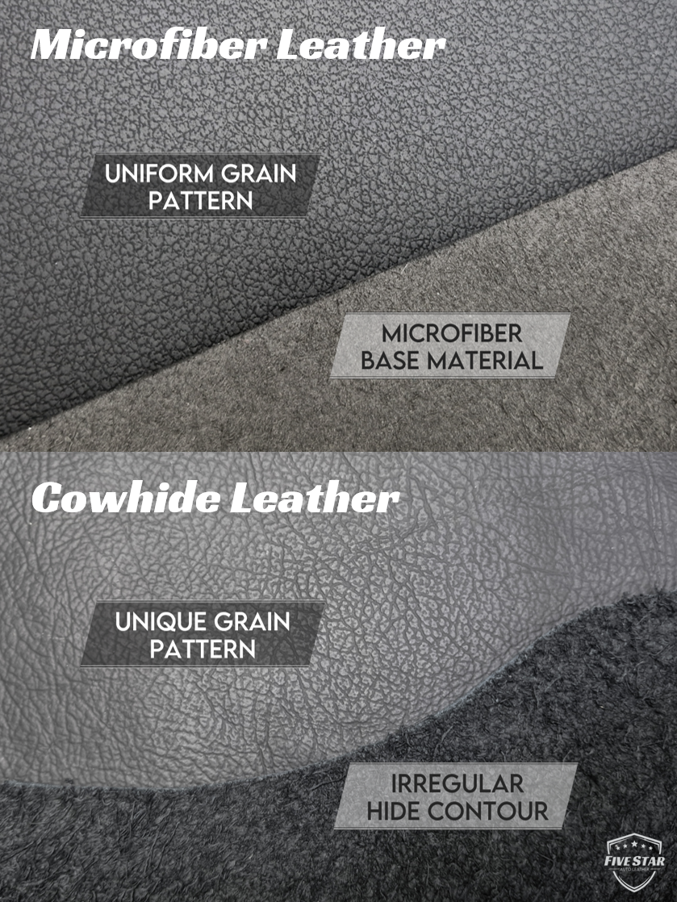
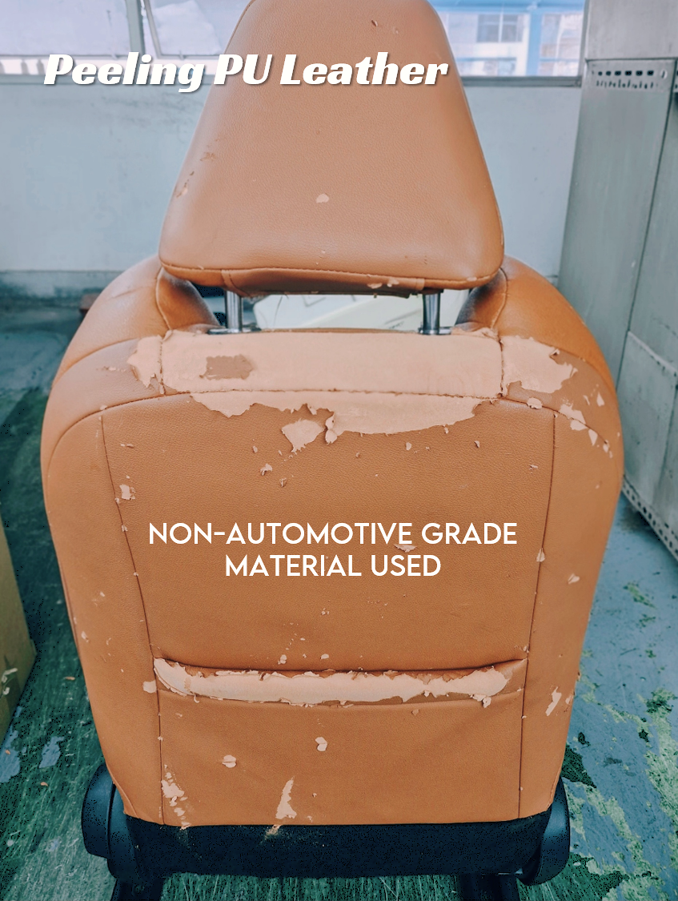
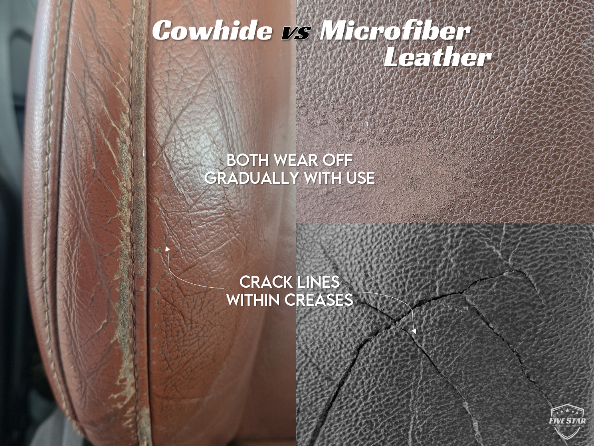

Over the years, the car upholstery industry has quietly shifted toward synthetic leather materials. Yet for customers, vegan leather often remains shrouded in mystery — sometimes even distrust. Much of this hesitation comes from outdated perceptions around durability, quality and longevity, shaped by poor-quality PU leather commonly used in furniture or fashion accessories.

At Five Star Auto Leather, we take a different approach. **We are proud to specialise exclusively in automotive-grade vegan microfiber leather** — a next-generation material engineered specifically for modern car interiors. It delivers the same premium look and tactile feel as traditional cowhide, without the cruelty, heavy maintenance, and excessive environmental burden.

Vegan leather can be just as premium as cowhide, if not better. Here’s why we believe so strongly in going vegan 🌱

## Environmental Impact: Choosing the Lesser of Two Evils

Environmental impact was the key factor that pushed us to seek alternatives and make a conscious choice.

There are countless studies comparing the environmental footprint of cowhide and vegan leather. While exact figures vary, both peer-reviewed research and industry analyses agree on one thing: **cowhide leather is highly carbon-intensive**. This is due to methane emissions from cattle, land use and deforestation for livestock feed, high water consumption, and chemical-heavy tanning processes.

In comparison, **automotive-grade vegan microfiber leather has roughly one-seventh the carbon footprint of cowhide leather**. Put simply, this means that the environmental impact of wrapping 1 set of car seats in cowhide is comparable to wrapping up to 7 sets using vegan leather — without even considering that cowhide’s irregular shape leads to more material waste.

That said, vegan leather isn’t perfect either. Cowhide is biodegradable at the end of its life cycle, whereas synthetic leathers are generally non-biodegradable and can persist in landfills for decades. Microplastic shedding during degradation is also a legitimate concern.

Ultimately, it comes down to choosing the lesser of two evils. We choose the option that doesn’t involve the killing of animals, while significantly reducing carbon emissions and resource consumption.

> 🌏 Want to read more on environmental impacts of the leather industry?
>
> - [Springer Global LCA Study on Cow Leather Industry](https://link.springer.com/article/10.1007/s43621-025-00798-6)
> - [ScienceDirect Life-Cycle Assessment of Bioleather vs Traditional Leather](https://www.sciencedirect.com/science/article/pii/S277280132200001X)

## Quality: Engineered for Automotive Use

We would never offer a material to our customers if its quality did not meet our standards.

Thanks to major advancements in manufacturing and material science in recent years, modern vegan leather has come a long way. Automotive-grade microfiber leather is crafted from ultra-fine fibres designed to replicate the internal structure of natural leather. The result is a surface that feels soft, supple, and luxurious which is often indistinguishable from cowhide to the touch.

More importantly, it is engineered for real-world car use and long-term durability. Our microfiber leather is UV-resistant, scratch-resistant, colour-stable, and highly resistant to wear, making it well-suited for daily driving conditions. Maintenance is also simple and requires nothing more than a clean cloth and water. Traditional cowhide, on the other hand, requires regular conditioning to prevent drying and premature ageing.

For modern drivers who want durability without the extra upkeep, vegan leather simply makes more sense.

> ✏️ Want a deep dive on types of car leather? Read our article: [3 Types of Car Leather and How to Identify Them](/blog/types-of-car-leather)

## Ageing, Wear & Tear: Addressing the Biggest Concern

The biggest hesitation customers have toward vegan leather usually stems from bad experiences with low-quality PU leather used in sofas, handbags, or cheap accessories. These materials are known to peel, flake, and fall apart in patches over time.

### Automotive-grade microfiber leather is fundamentally different.

Instead of peeling, it wears down gradually, much like natural leather. On high-contact areas such as seat side bolsters, you may see fine crack lines develop over time due to repeated abrasion from getting in and out of the car — just as you’d expect with cowhide. Flatter centre panels tend to age evenly and gracefully with use.

In short, when it reaches the end of its service life, microfiber leather doesn’t fail catastrophically. It simply ages honestly and naturally.

## Final Thoughts: A Conscious Choice for the Future

As a small family business, we are proud to make decisions we truly believe in and to stand by them. Choosing vegan leather is our way of contributing to a more socially responsible and sustainable future for generations to come.

We understand that every customer has different preferences, and we respect that. Our goal is not to force a choice, but to educate, inform, and challenge outdated assumptions about what vegan leather can be.

We’re also hopeful that emerging bio-based materials, such as apple or pineapple leather, will continue to evolve and eventually become robust enough for automotive use. The future of car interiors is changing, and we choose to move forward with optimism, responsibility, and intention.
